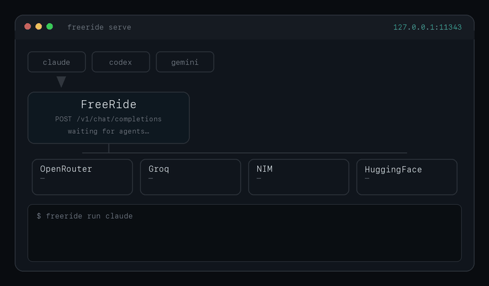

# FreeRide

**Free AI inference for real work — as a coding agent, or as a gateway for your own tools.**

FreeRide routes requests across free-tier providers — **OpenRouter, Groq, NVIDIA NIM, HuggingFace, Cerebras, Cloudflare Workers AI**, and **your own Ollama** — with automatic failover when one rate-limits or errors. No vendor subscription, no cloud middleman: your machine talks to the providers directly with your own free keys. There are two ways in; both run on the same engine.

> **102M+ tokens served in 35 days. $0 spent.**
> Routed through community free-tier keys via this gateway.
> Daily traffic: [free-ride.xyz/models](https://free-ride.xyz/models)



---

## Pick your path

### 🤖 "I want a coding agent" → ridex

A fast, native agent (our fork of [vercel-labs/fx](https://github.com/vercel-labs/fx), Apache-2.0) that reads files, edits code, and runs commands — every model call served free through FreeRide. One command installs the agent and the gateway, supervises the daemon, and walks you through keys on first run:

```bash
curl -sSL https://api.free-ride.xyz/ridex.sh | sh
ridex                                          # interactive agent
ridex ask "reply with the single word pong"    # or one-shot
```

Agent releases: [github.com/Shaivpidadi/ridex](https://github.com/Shaivpidadi/ridex). macOS + Linux (arm64/x86_64).

### 🔌 "I have my own tools" → the gateway

A local, OpenAI-compatible endpoint on `localhost:11343` that any agent, SDK, or script can point at — Aider, Continue.dev, LangChain, raw `openai` clients, your own code:

```bash
curl -sSL https://api.free-ride.xyz/install.sh | sh
freeride init && freeride serve
```

```bash
OPENAI_API_BASE=http://localhost:11343/v1
OPENAI_API_KEY=any-string-here   # inbound auth is ignored; your real keys stay server-side
```

It also natively serves the **Anthropic** (`/v1/messages`), **OpenAI Responses** (`/v1/responses`), **Gemini** (`:generateContent`), and **fx gateway** wire protocols, plus `/v1/embeddings` — so most tools work unmodified. Prefer the big-vendor CLIs' UX? `freeride run claude|codex|gemini` wraps them with no vendor login. macOS + Linux + Windows.

Already running ridex? You have the gateway too — one shared daemon on `:11343` serves your agent sessions and your own tools with the same keys, failover chain, and cooldowns.

---

## Keys

Any one is enough; more = better failover. Collected by `freeride init` (or ridex's first run) and stored **only** on your machine in `~/.freeride/.env`:

| Provider | Free tier | Get a key |
|---|---|---|
| OpenRouter | rotating free models | [openrouter.ai/keys](https://openrouter.ai/keys) |
| Groq | daily token cap | [console.groq.com/keys](https://console.groq.com/keys) |
| NVIDIA NIM | credits per account | [build.nvidia.com](https://build.nvidia.com) |
| HuggingFace | $0.10/mo Free, $2/mo PRO | [huggingface.co/settings/tokens](https://huggingface.co/settings/tokens) |
| Cerebras | RPM / TPM caps | [cloud.cerebras.ai](https://cloud.cerebras.ai) |
| Cloudflare Workers AI | 10K neurons/day | [dash.cloudflare.com](https://dash.cloudflare.com) |
| Ollama (local) | no quota | install from [ollama.com](https://ollama.com) |

## Why this doesn't fall over

Free tiers are flaky — that's the whole reason FreeRide exists. Whichever path you picked, the same engine keeps a single provider's bad minute from ever reaching you:

- **The gateway is a supervised daemon** (via the ridex installer): registered with launchd (macOS) or a systemd user unit (Linux), a crash restarts it in seconds. `ridex start|stop|restart|doctor` manage it, and `ridex stop` sticks until you say otherwise. (Standalone `freeride serve` users manage the process themselves, as before.)
- **Every request carries a fallback ladder.** If the serving provider rate-limits, runs out of free inference, or retires the model mid-session, the gateway silently retries on the next provider's best tool-capable model — inside the same response. Failed candidates are remembered for a few minutes so consecutive turns don't re-pay the cost.
- **The agent can diagnose its own plumbing.** ridex ships with a `freeride` skill: when requests fail it runs the (pre-approved, read-only) diagnostics — `freeride doctor`, `freeride keys`, the health probe — reads the structured error taxonomy, and tells you the exact fix.
- **Tool calls are non-negotiable.** The default `freeride/coding` route pins to models proven to emit correct tool calls; providers whose catalogs can't do tools are never handed agent traffic.

Inside a session, `/model` switches routing per request: `freeride/coding` (default), `freeride/fast` (Groq-first, low TTFT), `freeride/quality` (OpenRouter-first, widest catalog), `freeride/free` / `auto` (pure smart-routing), or any concrete model id from `ridex models`.

---

## Wrap the big-vendor CLIs

Prefer Claude Code, OpenAI Codex, or Gemini CLI's UX? `freeride run` points them at the gateway — no per-vendor key, no login:

```bash
freeride run claude    # /model freeride/coding etc. inside the session
freeride run codex     # Responses-API wire format translated natively
freeride run gemini    # Google's {contents, tools, generationConfig} shape both ways
```

Guides: [`docs/agents/claude-code.md`](docs/agents/claude-code.md) · [`docs/agents/codex.md`](docs/agents/codex.md) · [`docs/agents/gemini.md`](docs/agents/gemini.md). For Aider, Continue.dev, and friends: `freeride bind <agent>` ([`docs/agents/binders.md`](docs/agents/binders.md)).

---

## How failover works

Per-request the chain is **(provider, key)**, sorted by recent health:

1. Try the head pair.
2. **`RATE_LIMIT`** or **`AUTH`** error → mark the key as cooling, try the next key on the same provider.
3. **`MODEL_NOT_FOUND`** or **`QUOTA_EXHAUSTED`** → skip to the next provider.
4. **5xx / TIMEOUT** → next pair.
5. First successful response — stamp `X-FreeRide-Provider` + `X-FreeRide-Request-Id` headers and ship.

Agent traffic gets a second layer on top: the **candidate ladder** walks (provider, tool-capable model) pairs, so even a model that exists on only one cooling provider falls through to a working equivalent elsewhere — silently, under streaming keepalives. If every pair fails, you get a structured 503 with a per-provider breakdown so debugging is one log line, not five round-trips. An upstream dying mid-stream before any output switches candidates invisibly; after output the turn ends as an explicit error (agents retry it) rather than a silently truncated answer.

**Smart routing for `model: "auto"`:** the resolver scores every free model in the catalog by health × popularity (from the public [models leaderboard](https://free-ride.xyz/models)) and picks the best one. Run `freeride audit-models` once after install to cache health probes locally so the first real request isn't a cold start.

Deeper: [`docs/architecture/failover.md`](docs/architecture/failover.md).

---

## Providers

| Provider | Surface | Notes |
|---|---|---|
| OpenRouter | chat, streaming, tools, vision, structured outputs, embeddings | full surface — the most-used provider in our routing |
| NVIDIA NIM | chat + embeddings | curated free-model allowlist; `NVIDIA_NIM_FREE_MODELS_OVERRIDE` to expand |
| Groq | chat | Llama 3.x, Gemma 2, Mixtral, DeepSeek-R1-distill; daily token cap |
| Cloudflare Workers AI | chat | cheap-per-neuron models; needs `CLOUDFLARE_ACCOUNT_ID` |
| HuggingFace Inference | chat + embeddings | full HF router catalog; budget governs access |
| Cerebras | chat | fastest Llama / Qwen inference; no embeddings |
| Ollama (local) | chat | local-only; can mix with remote in the same failover chain |

Adding a new provider: implement `freeride.core.provider.Provider` in `freeride/providers/<name>.py`, register it in the conformance suite. See [`CONTRIBUTING.md`](CONTRIBUTING.md).

---

## Multi-key rotation

Provide more than one key per provider with a numbered suffix:

```bash
OPENROUTER_API_KEY=sk-or-v1-aaa     # primary
OPENROUTER_API_KEY_2=sk-or-v1-bbb
OPENROUTER_API_KEY_3=sk-or-v1-ccc
```

The router tries them in health order. A 429 on one key cools it for the next 60s and rotates to the sibling key — no provider switch needed. On startup `freeride keys` shows which keys are available vs cooling.

---

## See what the gateway is doing

```bash
ridex doctor                   # agent binary + daemon + key status in one report
freeride doctor                # static checks: keys, ports, /etc/hosts, common gotchas
freeride audit-models          # probe every free model on every key; cache the results
freeride bench                 # measure p50/p95/tok-s per provider
```

Tail live events:

```bash
tail -f ~/.freeride/events.jsonl
```

Each line is a JSON event: routing decisions, provider attempts, ladder fallbacks, response statuses, mid-stream errors. Same schema the marketing site reads to render the [live token counter](https://free-ride.xyz) and [provider leaderboard](https://free-ride.xyz/models).

---

## Telemetry

A small beacon ships hourly with **counts only**: tokens served, request count, active providers, uptime hours, OS, version, and a per-install UUID. **Never sent:** prompts, completions, model IDs, API keys, hostname, IP.

```bash
freeride telemetry        # audit what the next beacon would post
freeride telemetry off    # opt out
```

The aggregate is what powers [free-ride.xyz/models](https://free-ride.xyz/models). Default on; explicit disclosure banner prints on first run.

---

## Commands

```
ridex                   interactive coding agent (auto-starts the gateway daemon)
ridex ask <prompt>      one noninteractive agent request
ridex models            list available models
ridex start|stop|restart  manage the gateway daemon (stop sticks)
ridex doctor            agent + daemon + key health report

freeride init           interactive setup wizard — prompts for keys, writes ~/.freeride/.env
freeride serve          start the gateway on :11343 (the daemon runs this for you)
freeride run <cli>      wrap a CLI (claude / codex / gemini) — points it at the gateway
freeride bind <agent>   write the agent's config so it uses the gateway permanently
freeride doctor         pre-flight checks: keys, ports, hosts file, common gotchas
freeride keys           which provider keys are available vs cooling
freeride reload         hot-reload provider keys on a running gateway
freeride audit-models   probe every free model; cache health locally
freeride bench          measure p50/p95/tok-s per provider
freeride list           list available free models
freeride telemetry      manage the hourly aggregate beacon
```

---

## Docs

- **The agent**
  - [github.com/Shaivpidadi/ridex](https://github.com/Shaivpidadi/ridex) — the ridex agent (fork of vercel-labs/fx)
  - [`internal-docs/RIDEX_PLAN.md`](internal-docs/RIDEX_PLAN.md) — architecture decisions + verification log
- **Wrapped CLIs**
  - [`docs/agents/claude-code.md`](docs/agents/claude-code.md) — Claude Code setup, `/model` modes, troubleshooting
  - [`docs/agents/codex.md`](docs/agents/codex.md) — OpenAI Codex setup, bwrap notes, model selection
  - [`docs/agents/gemini.md`](docs/agents/gemini.md) — Google Gemini CLI setup, auth flow, model selection
  - [`docs/agents/binders.md`](docs/agents/binders.md) — Aider, Continue, OpenClaw — per-agent `freeride bind` reference
  - [`docs/agents/hermes.md`](docs/agents/hermes.md) — NousResearch Hermes agent integration
- **Providers**
  - [`docs/providers/SURVEY.md`](docs/providers/SURVEY.md) — per-provider fit (auth, free-tier semantics, error mapping)
  - [`docs/providers/nvidia_nim.md`](docs/providers/nvidia_nim.md) — NVIDIA NIM specifics
- **Architecture**
  - [`docs/architecture/failover.md`](docs/architecture/failover.md) — failover chain, cooldown, health tracking
  - [`docs/architecture/translators.md`](docs/architecture/translators.md) — how the Anthropic / Google / OpenAI-Responses / fx translators work
- **Other**
  - [`CONTRIBUTING.md`](CONTRIBUTING.md) — adding a provider, a CLI wrapper, or a binder
  - [`SECURITY.md`](SECURITY.md) — reporting vulnerabilities

---

## License

MIT. The ridex agent is a fork of [vercel-labs/fx](https://github.com/vercel-labs/fx) (Apache-2.0); its license and notices ship with every release tarball.
